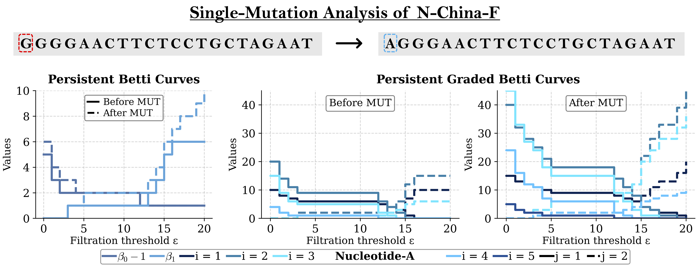

# GBNL
Graded Betti Number Learning of Protein-DNA/RNA Binding Affinity

---

## Table of Contents
- [Introduction](#introduction)
- [Model Interpretability](#model-Interpretability)
- [Prerequisites](#prerequisites)
- [Datasets](#datasets)
- [Modeling with PSRT-based features using CAP pipeline](#Modeling-with-PSRT-based-features)
- [Results](#results)
- [Citation](#citations)

---

## Introduction

The prediction of protein-nucleic acid binding affinity is a critical challenge in biology and drug discovery. Accurate machine learning predictions rely on deciphering both intermolecular and intramolecular interactions within complex molecular 3D structures. We proposed a novel mathematical framework based on commutative algebra theory, which effectively analyzes key molecular interaction patterns without the need of any structure information.By integrating the resulting sequence descriptors with machine learning algorithms, we developed highly competitive models for protein-nucleic acid binding affinity prediction. Benchmark comparisons on an earlier dataset and two new datasets curated in this work, demonstrate that our models achieve robust performance.

> **Keywords**: Persistent commutative algebra, facet persistence barcodes, persistent ideals, commutative algebra learning, protein-nucleic acid binding.

---

## Model Interpretability

An illustration of the comparison between Persistent Homology and Persistent Stanley-Reisner Invariant on the N2-U.S-P primer sequence is shown below.

---

## Prerequisites

- numpy                     1.21.0
- scipy                     1.7.3
- pytorch                   1.10.0 
- pytorch-cuda              11.7
- torchvision               0.11.1
- scikit-learn              1.0.2
- python                    3.10.12
- biopandas                 0.4.1
--- 

## Datasets

Sequence-based representations of proteins and DNA/RNA, along with their corresponding binding affinity labels, are provided in this repository.

Datasets used in this study:

| Dataset | Type                 | Number of Complexes | Download                     |
|---------|----------------------|---------------------|------------------------------|
| S186    | Protein–Nucleic Acid | 186                 | [data](./Datasets/S186.csv) |
| S142    | Protein–RNA          | 142                 | [data](./Datasets/S142.csv) |
| S322    | Protein–DNA          | 322                 | [data](./Datasets/S322.csv) | 

The S186 dataset was curated from [Shen2023].

---

### I. Modeling with PSRT-based features using CAP pipeline

Codes can be provided upon request. 

### II. Generation of sequence-based ESM2 features for proteins
Protein sequence embeddings were generated with [Transformer Protein language model ESM2](https://github.com/facebookresearch/esm) [Rives2021].

## Results

### Modeling the Protein–Nucleic Acid Datasets

| Dataset | Training/Test Set | PCC  | RMSE (kcal/mol) |  
|---------|----------|------|------------------|  
| S186 [result](./Results/S186_predictions.csv) | 186 | 0.705 | 1.79 |  
| S142 [result](./Results/S142_predictions.csv) | 142 | 0.653 | 2.18 |  
| S322 [result](./Results/S322_predictions.csv) | 322 | 0.669 | 2.00 |

> Note: Predictions were made using Gradient Boosting Regressor Tree (GBRT) models trained on sequence-based features extracted from protein and nucleic acid sequences. Each dataset was evaluated using independently trained models under 20 random initializations. The predictions for all three datasets can be found in the [results](./Results) folder.

---

## Citations

- [Suwayyid2025] Faisal Suwayyid and Guo-Wei Wei.  
  *Persistent Stanley–Reisner Theory*.  
  arXiv:2503.23482, 2025.  
  [https://arxiv.org/abs/2503.23482](https://arxiv.org/abs/2503.23482)
  
- [Shen2023] Shen, Li, Hongsong Feng, Yuchi Qiu, and Guo-Wei Wei.  
  "SVSBI: sequence-based virtual screening of biomolecular interactions."  
  *Communications Biology* 6, no. 1 (2023): 536.  
  [https://doi.org/10.1038/s42003-023-05084-0](https://doi.org/10.1038/s42003-023-05084-0)

- [Rives2021] Rives, Alexander, Joshua Meier, Tom Sercu, Siddharth Goyal, Zeming Lin, Jason Liu, Demi Guo et al.  
  "Biological structure and function emerge from scaling unsupervised learning to 250 million protein sequences."  
  *Proceedings of the National Academy of Sciences* 118, no. 15 (2021): e2016239118.  
  [https://doi.org/10.1073/pnas.2016239118](https://doi.org/10.1073/pnas.2016239118)

---
