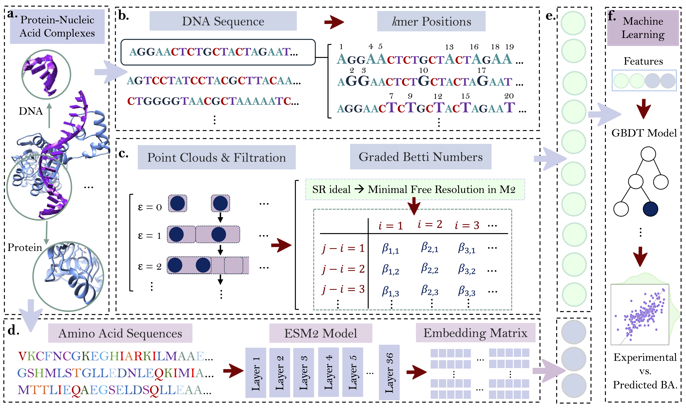

# GBNL: Graded Betti Number Learning of Protein-DNA/RNA Binding


---
GBNL is the first commutative algebra graded Betti framework applied to a biomolecular system, encoding nucleic acid organization via graded Betti numbers tracked over a positional filtration for protein-nucleic acid binding prediction. These algebraic descriptors are paired with transformer-based ESM2 protein embeddings to capture interface chemistry at two complementary scales. The result is a compact, interpretable feature set for predicting protein-DNA/RNA binding.

## Table of Contents
- [Overview](#description)
- [Model Interpretability](#model-Interpretability)
- [Prerequisites](#prerequisites)
- [Datasets](#datasets)
- [Reproducibility](#reproducibility)
- [Citation](#citations)

---

## Overview
Interpretable prediction of protein-nucleic acid binding affinity calls for methods that are sensitive to fine sequence variation yet remain transparent. We present Graded Betti Number Learning (GBNL) for protein-nucleic acid binding, introducing the first use of commutative algebra graded Betti numbers in any biomolecular setting. Building on persistent commutative algebra (PCA)’s role in tracking topological invariants, GBNL represents each sequence as k-mer position sets under sequential positional filtration and derives persistent graded Betti invariants from PCA, producing topological representations of local nucleotide organization. To incorporate cross-molecule context, these topological features are paired with transformer-based protein embeddings, linking nucleotide-level signals with global protein regularities. The graded Betti signal cleanly identifies single-site edits and distinguishes complete mutation patterns. Operating on primary sequences with minimal pre-processing, GBNL bridges commutative algebra, reduced algebraic topology, combinatorics, and machine learning, establishing a new paradigm for comparative sequence analysis and biomolecular prediction

---

## Model Interpretability

#### An illustration of single mutation analysis by GBNL for N-China-F. Rows: nucleotides. Column 1: PH Betti curves; columns 2 and 3: persistent graded Betti, all shown before and after mutation(MUT).

GBNL framework captures a single-base mutation in the N-China-F primer of the SARS-CoV-2 N gene with high sensitivity. A single alteration in the reference sequence GGGGAACTTCTCCTGCTAGAAT to AGGGAACTTCTCCTGCTAGAAT at position 28881 (G→A) produces measurable topological and algebraic shifts.


---

## Prerequisites

The codes were tested on an HPCC environment. The implementation is in Python.

- numpy                     1.21.0
- scipy                     1.7.3
- pytorch                   1.10.0
- pytorch-cuda              11.7
- torchvision               0.11.1
- scikit-learn              1.0.2
- python                    3.10.12
- biopandas                 0.4.1
- Macaulay2 (M2)            tested via Singularity/Apptainer container (not a system install)

#### Macaulay2 Installation via Singularity (HPCC)

If M2 is not available system-wide, run it through a container and expose an `M2` wrapper on your PATH.

```bash
# 0) Ensure Singularity or Apptainer is available
command -v singularity >/dev/null 2>&1 || module load singularity
# If cluster uses Apptainer, replace 'singularity' with 'apptainer' below.

# 1) Paths
REALHOME="$(readlink -f "$HOME")"
IMG_DIR="$REALHOME/GBNL/opt/macaulay2"
IMG="$IMG_DIR/m2-1.24.05.sif"
WRAP="$REALHOME/bin/M2"
mkdir -p "$IMG_DIR" "$REALHOME/bin" "$REALHOME/PGBN"

# 2) Pull the image
[ -f "$IMG" ] || singularity pull "$IMG" docker://unlhcc/macaulay2:1.24.05

# 3) Wrapper so 'M2' behaves like a normal binary
cat > "$WRAP" <<'SH'
#!/usr/bin/env bash
REALHOME="$(readlink -f "$HOME")"
exec singularity exec "$REALHOME/GBNL/opt/macaulay2/m2-1.24.05.sif" M2 -q "$@"
SH
chmod +x "$WRAP"

# 4) Put ~/bin on PATH
grep -q 'export PATH="$HOME/bin:$PATH"' "$REALHOME/.bashrc" 2>/dev/null || echo 'export PATH="$HOME/bin:$PATH"' >> "$REALHOME/.bashrc"
export PATH="$REALHOME/bin:$PATH"

# 5) Quick test
which M2 && M2 --version
```
---
## Datasets

Sequence-based representations of proteins and DNA/RNA, along with their corresponding binding affinity labels, are available in the **CAP (Commutative Algebra Prediction)** repository.

Datasets used in this study:

| Dataset | Type                 | Number of Complexes | Download |
|----------|----------------------|---------------------|-----------|
| S186     | Protein–Nucleic Acid | 186                 | [View in CAP Repository](https://github.com/mzia-s/CAP/tree/f603c299b2c39e0aad0fa536ddb5adbfcdbc0439/Datasets/S186.csv) |
| S142     | Protein–RNA          | 142                 | [View in CAP Repository](https://github.com/mzia-s/CAP/tree/f603c299b2c39e0aad0fa536ddb5adbfcdbc0439/Datasets/S142.csv) |
| S322     | Protein–DNA          | 322                 | [View in CAP Repository](https://github.com/mzia-s/CAP/tree/f603c299b2c39e0aad0fa536ddb5adbfcdbc0439/Datasets/S322.csv) |

> **Note:** These datasets are hosted in the [CAP repository](https://github.com/mzia-s/CAP). 
---

## Reproducibility

### I. Generation of features for nucleic acids
Run:
```bash
sbatch run_gbnl.sh
# (or: bash run_gbnl.sh)
```
By default, this generates four output files for the example SEQ_ID="N-China-F" (primer with a single mutation at position 28881, G→A), one file per nucleotide (A, C, G, T) for $k$-mer=1:
```bash
./outputs/001_N-China-F/001_N-China-F_A_vr1_k1.txt
./outputs/001_N-China-F/001_N-China-F_C_vr1_k1.txt
./outputs/001_N-China-F/001_N-China-F_G_vr1_k1.txt
./outputs/001_N-China-F/001_N-China-F_T_vr1_k1.txt
```

### II. Generation of sequence-based ESM2 features for proteins
Protein sequence embeddings were generated with [Transformer Protein language model ESM2](https://github.com/facebookresearch/esm) [Rives2021].


## Citation

If you wish to cite this work, please use the following citation:

  

---
